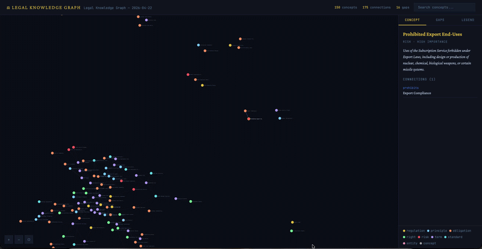

# ⚖ Legal Knowledge Wiki


Transform legal documents into a **living knowledge graph**. Feed in contracts, regulations,
playbooks or guidance documents — the tool extracts legal concepts, maps their relationships,
identifies knowledge gaps, and produces a full research environment: interactive graph,
markdown wiki, source pages, gap-bridge prompts, project context files, incremental ontology,
and prioritised to-do lists.

Inspired by Karpathy's LLM Wiki pattern and adapted for professional legal work.



> **Terminal preview**
> 

---

## ✦ Full output on each run

```
sources/                         Output:
  ├── GDPR.pdf            →      output/knowledge_graph.html     ← interactive D3.js graph
  ├── DPA_template.docx   →      output/graph_prompts.md         ← ready-to-paste Claude prompts
  └── DORA_guide.md       →      wiki/                           ← one article per concept
                                 wiki/sources/                   ← one page per source document
                                 gaps/gap_analysis.json          ← structured gap analysis
                                 todo/                           ← prioritised action lists
                                 .infranodus/ontology.json       ← living memory (incremental)
                                 CLAUDE.md                       ← project context for Claude Code
                                 agents.md                       ← agent workflow configuration
```

---

## ✦ Five phases

| Phase | What happens |
|-------|-------------|
| **1. Extract** | PDF/DOCX/TXT → Claude extracts concepts, definitions, types, importance |
| **2. Connect** | Cross-document connection mapping + structured gap analysis |
| **3. Source pages** | One rich wiki page per ingested document (summary, takeaways, gaps) |
| **4. Wiki articles** | One markdown article per concept with wikilinks |
| **5. Outputs** | Graph + gap prompts + todos + ontology + CLAUDE.md + agents.md |

---

## ✦ Key features

### Interactive knowledge graph (`output/knowledge_graph.html`)
Self-contained HTML — open with any browser, no server needed:
- Force-directed D3.js graph with colour-coded node types
- Node size reflects importance; dashed rings mark knowledge gaps
- Click any node for definition, connections, related concepts
- Gap analysis panel with missing definitions and research questions
- Search bar, zoom/pan/drag

### Gap-bridge prompts (`output/graph_prompts.md`)
The graph structure is exported as **ready-to-paste Claude prompts**.
Each prompt includes the underlying JSON graph so Claude reasons structurally —
not just by retrieval. Paste directly into Claude Code terminal to bridge gaps.

### Source pages (`wiki/sources/`)
One structured page per ingested document: summary, key takeaways, evidence/data,
notable provisions, relevant concepts (as wikilinks), and open questions.

### Living ontology (`.infranodus/`)
Incrementally updated across runs — new concepts and connections are merged,
not overwritten. Historical snapshots in `.infranodus/history.jsonl`.

### Project context (`CLAUDE.md` + `agents.md`)
Auto-generated on every run. Open the project in Claude Code and it immediately
understands the knowledge base structure, active gaps, and available workflows.

### Prioritised todos (`todo/`)
Three files: sources to add, concepts to develop, research questions to answer —
all derived from the gap analysis and updated automatically.

---

## ✦ Concept types

| Type | Description | Example |
|------|-------------|---------|
| `regulation` | Laws and regulations | GDPR, DORA, EU AI Act |
| `principle` | Legal principles | Accountability, Proportionality |
| `obligation` | Legal duties | Data Breach Notification |
| `right` | Legal rights | Right to Erasure |
| `risk` | Legal risks | Unlimited Liability |
| `term` | Defined terms | Personal Data, Controller |
| `standard` | Technical/compliance standards | ISO 27001 |
| `entity` | Organisations/parties | Data Subject, DPA |

---

## ✦ Setup

```bash
git clone https://github.com/marcoderoni/legal-knowledge-wiki
cd legal-knowledge-wiki

python3 -m venv venv
source venv/bin/activate        # Windows: venv\Scripts\activate

pip install -r requirements.txt

cp env.example .env
# Edit .env and add: ANTHROPIC_API_KEY=your_key_here
```

---

## ✦ Usage

```bash
# Full pipeline — process all docs in sources/
python main.py

# Custom sources folder
python main.py --sources /path/to/legal/docs

# Fast run: graph + prompts + todos only (no wiki articles, no API calls for wiki)
python main.py --no-wiki --no-source-pages

# Regenerate graph/prompts/todos from saved extractions (no API calls at all)
python main.py --mode graph

# Regenerate wiki articles only
python main.py --mode wiki

# Don't auto-open browser
python main.py --no-browser
```

### Input formats
- PDF (`.pdf`) — via pdfplumber
- Word (`.docx`, `.doc`) — via python-docx
- Plain text / Markdown (`.txt`, `.md`)

---

## ✦ Working with the knowledge base in Claude Code

Once built, open the project folder in Claude Code. `CLAUDE.md` gives Claude
full context. Example prompts:

```
"Summarise the main legal obligations in this knowledge base"
"What are the biggest gaps between GDPR and DORA coverage?"
"Use the prompt in output/graph_prompts.md to bridge the gap between X and Y"
"Draft a risk memo on data transfer based on the wiki"
"Which source documents cover controller obligations?"
```

---

## ✦ Project structure

```
legal-knowledge-wiki/
├── main.py                      # CLI entry point
├── CLAUDE.md                    # auto-generated — Claude Code context
├── agents.md                    # auto-generated — agent workflow config
├── requirements.txt
├── config/settings.yaml
├── extractor/document.py        # PDF/DOCX/TXT extraction + chunking
├── analyzer/
│   ├── concepts.py              # Claude API: concept extraction
│   └── connections.py           # Claude API: cross-doc connections + gaps
├── reporter/
│   ├── wiki.py                  # Concept wiki article generator
│   ├── source_wiki.py           # Source document page generator  ← NEW
│   ├── visualizer.py            # D3.js HTML graph generator
│   ├── prompt_export.py         # Gap-bridge prompt exporter       ← NEW
│   ├── project_docs.py          # CLAUDE.md + agents.md generator  ← NEW
│   ├── ontology.py              # Incremental .infranodus/ manager  ← NEW
│   └── todo.py                  # Prioritised todo generator        ← NEW
├── sources/                     # ← drop documents here
├── wiki/                        # generated concept articles
│   └── sources/                 # generated source pages
├── concepts/                    # raw JSON extractions
├── connections/                 # connection JSON
├── gaps/                        # gap analysis JSON
├── output/                      # HTML graph + gap prompts
├── todo/                        # action lists
└── .infranodus/                 # living ontology (incremental)
```

---

## ✦ Configuration (`config/settings.yaml`)

### Model choice: Opus vs Sonnet

This project defaults to **`claude-opus-4-5`** — the most capable Claude model, producing richer concept extraction, more precise relationship mapping, and deeper gap analysis. The tradeoff is speed and cost: expect ~45–60 minutes for a typical set of 5 legal documents.

Switch to **`claude-sonnet-4-5`** for faster, cheaper runs (~5–10 minutes) with only a minor reduction in extraction quality. Recommended for iterative testing; use Opus for final knowledge base builds.

```yaml
anthropic:
  model: claude-opus-4-5       # or claude-sonnet-4-5 for faster/cheaper
  max_tokens: 4096

extraction:
  max_chunk_size: 8000
  overlap: 200

graph:
  max_nodes: 150
  open_browser: true
```

---

## ✦ Part of the Legal AI Toolkit

| Project | Description |
|---------|-------------|
| [Legal AI Toolkit](https://github.com/marcoderoni/legal-ai-toolkit) | Claude Code agent + Make automation |
| [Contract Scanner](https://github.com/marcoderoni/contract-scanner) | Single-contract R/Y/G risk assessment |
| [Contract Bulk Analyzer](https://github.com/marcoderoni/contract-bulk-analyzer) | Cross-portfolio analysis |
| [Legal GPT Reviewer](https://github.com/marcoderoni/legal-gpt-reviewer) | Provider-agnostic reviewer (Claude + OpenAI/Groq) |
| **Legal Knowledge Wiki** | **This project — knowledge graph from legal docs** |

---

## License

MIT © Marco De Roni 2026
